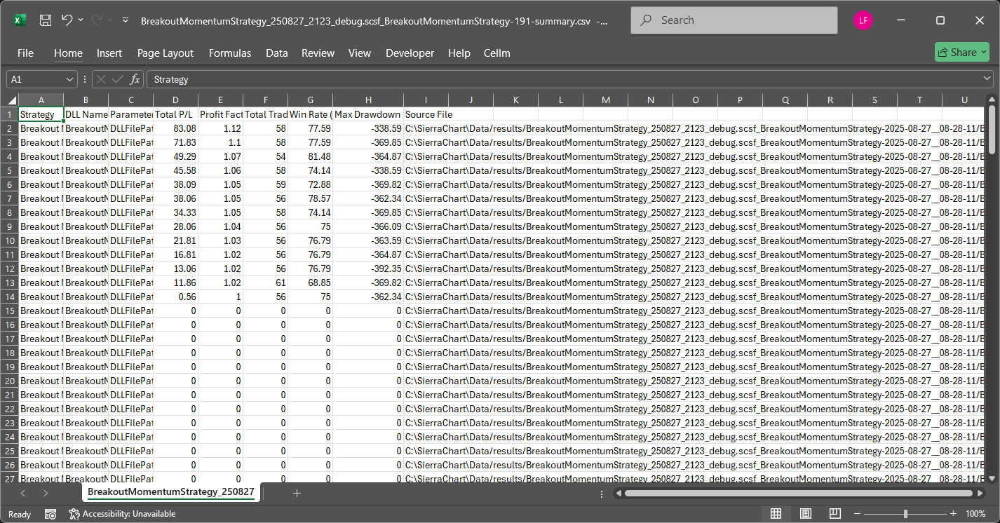
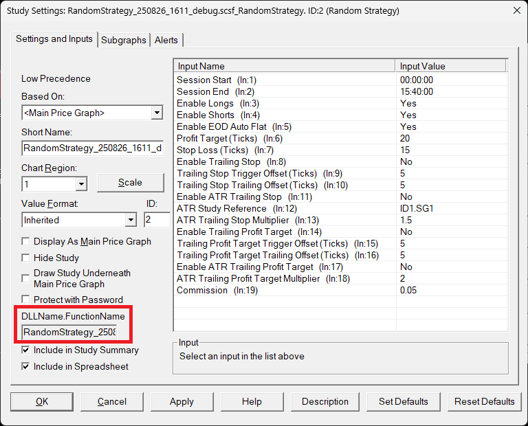
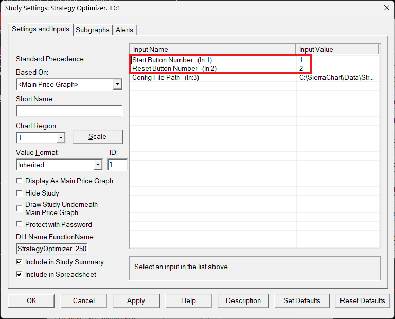
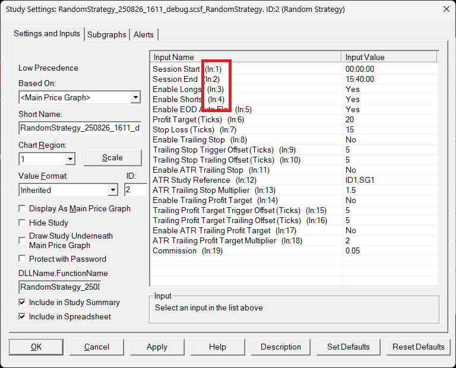

# Sierra Chart ACSIL Strategy Optimizer

## Features

-   **Automated Backtesting**: Executes your trading strategy across all possible parameter combinations within user-defined ranges.
-   **Parameter Optimization**: Helps you discover the most profitable and robust settings for your strategy.
-   **JSON-Based Configuration**: Easily configure backtest parameters, including study inputs, replay settings, and start date.
-   **Detailed Logging**: Provides real-time feedback and detailed logs of the backtesting process, displayed directly on the chart.
-   **Result Analysis**: Automatically generates a summary CSV file from results of all backtest runs, sorted by profitability.
-   **Configuration Verification**: Allows you to verify your configuration settings and see the applied study inputs before starting a full backtest.

## How It Works

The Strategy Optimizer reads a configuration file (e.g., `StrategyOptimizerConfig.json`) that defines the parameters for the backtest. This file includes the name of the study to be tested, the input ranges for each parameter, and the replay settings.

You can use the "Verify Config" button to load your configuration and display the initial study inputs on the chart, allowing you to confirm that your settings are correctly interpreted before running a full optimization.

When you click the "Start" button, the optimizer generates all possible parameter combinations and begins the backtesting process. It systematically applies each combination to the target study, runs a chart replay, and logs the performance metrics for each run into individual JSON files.

After all combinations have been tested, the optimizer generated JSON files and creates a summary CSV report, with the results sorted by total profit/loss.

The "Reset / Stop" button allows you to clear the current state and stop replay.

[<video controls src="images/2025-08-27 05-33-51-1.mp4" title=""></video>
](https://github.com/user-attachments/assets/fb0005f0-b4c7-4264-9b12-fdf3115ef22b)

## Quick Start Guide

### Prerequisites

*   You must have a working ACSIL strategy study loaded in a Sierra Chart chart.

*   The chart should be configured with the instrument and timeframe you wish to use for the backtest replay.

### Steps

1.  **Download DLL**: Download the compiled DLL file for this study, or compile it yourself.
2.  **Install DLL**: Place the downloaded DLL file into your Sierra Chart `Data` directory (usually `C:\SierraChart\Data`).
3.  **Add the Optimizer Study**:
    *   In Sierra Chart, open the chart where your strategy is applied.
    *   Press `F6` to open the **Chart Studies** window.
    *   Click the **Add Custom Study** button.
    *   Find and select **Strategy Optimizer** from the list and click **Add**.
4.  **Configure the Optimizer Study**:
    *   In the **Chart Studies** window, select the **Strategy Optimizer** study and go to its **Settings**.
    *   Locate the **Config File Path** input. This is where you will specify the path to your configuration file. The default is `C:\SierraChart\Data\StrategyOptimizerConfig.json`.
5.  **Create and Configure the JSON file**:
    *   Find the [`StrategyOptimizerConfig.example.json`](https://github.com/tanchekwei/SierraChartStrategyOptimizer/blob/main/StrategyOptimizerConfig.example.json) file in the repository.
    *   Make a copy of this file and rename it to `StrategyOptimizerConfig.json` in your Sierra Chart `Data` directory.
    *   Open `StrategyOptimizerConfig.json` and update it for your backtesting needs. Refer to the **JSON Configuration Example** section below for details.
6.  **Link Your Strategy**:
    *   In `StrategyOptimizerConfig.json`, set the `customStudyShortName` field.
    *   In the Sierra Chart **Chart Studies** window, select the strategy study you want to optimize. Go to its **Settings** and set its **Short Name** to the *exact same value* as `customStudyShortName`. **This is crucial for the optimizer to find your study.**
    *   In `StrategyOptimizerConfig.json`, set the `customStudyFileAndFunctionName` field to the full name of your study's DLL and function name (find it in study setting `DLLName.FunctionName`) text box (e.g., `MyStrategyDLL_1234.scsf_MyStrategyFunction`).

    

7.  **Add Control Bar Buttons**:
    *   Right-click on a control bar in Sierra Chart (e.g., Control Bar 1).
    *   Select **Customize Control Bar...**.
    *   In the **Available Control Bar Commands**, expand **Advanced Custom Study Button**.
    *   Add **ACS6 - Verify Config | CS6**, **ACS7 - Start | CS7** and **ACS8 - Reset | CS8** to your control bar.
    *   If any of these button numbers (6, 7, 8) are already in use, update the corresponding button numbers in the Strategy Optimizer settings to an available option.
    *   **Verify Config (CS6)**: Loads and displays the configuration parameters on the chart without starting a replay. Use this to ensure your `StrategyOptimizerConfig.json` is correctly parsed and the study inputs are set as expected.
    *   **Start (CS7)**: Begins the full backtesting and optimization process.
    *   **Reset (CS8)**: Clears the current state of the optimizer.

    

8.  **Verify Configuration (Recommended)**:
    *   Before running a full optimization, click the **CS6** (Verify Config) button on your control bar.
    *   Check the chart log to confirm that your `StrategyOptimizerConfig.json` file has been loaded correctly and the study inputs for the first combination are displayed as intended.

9.  **Run the Optimization**:
    *   Once everything is configured and verified, click the **CS7** (Start) button on your control bar to begin the optimization process.

## JSON Configuration Example

Here is an example of a configuration file.

```json
{
    "customStudyFileAndFunctionName": "RandomStrategy_250823_1414_debug.scsf_RandomStrategy",
    "customStudyShortName": "test",
    "openResultsFolder": true,
    "replayConfig": {
        "replaySpeed": 888,
        "startDate": "2025-08-20",
        "startTime": "12:00:00.000",
        "replayMode": 2,
        "chartsToReplay": 0,
        "clearExistingTradeSimulationDataForSymbolAndTradeAccount": 1
    },
    "logConfig": {
        "enableLog": true,
        "enableShowLogOnChart": true,
        "maxLogLines": 20
    },
    "paramConfigs": [
        {
            "type": "int",
            "index": 5,
            "min": 1,
            "max": 2,
            "increment": 1
        },
        {
            "type": "float",
            "index": 6,
            "min": 1,
            "max": 2,
            "increment": 0.5
        },
        {
            "type": "bool",
            "index": 9,
            "min": 0,
            "max": 1,
            "increment": 1
        },
    ]
}
```

-   **`customStudyFileAndFunctionName`**: The full function name of the study to be optimized (FileName.FunctionName).
-   **`customStudyShortName`**: A short name for the study. This is required for the optimizer to get the study ID.
-   **`openResultsFolder`**: (Optional) Set to `true` to automatically open the results folder after the optimization is complete. Defaults to `true`.
-   **`replayConfig`**: An object containing replay settings.
    -   **`replaySpeed`**: The replay speed.
    -   **`startDate`**: The replay start date.
    -   **`startTime`**: The replay start time.
    -   **`replayMode`**: The replay mode. Possible values: `1` (Standard), `2` (Accurate Trading System Back Test), `3` (Calculate at Every Tick), `4` (Calculate Same as Real-Time).
    -   **`chartsToReplay`**: The charts to replay. Possible values: `0` (Single Chart), `1` (All Charts in Chartbook), `2` (Charts with Same Link Number).
    -   **`clearExistingTradeSimulationDataForSymbolAndTradeAccount`**: Set to `1` to clear existing simulation data.
-   **`logConfig`**: (Optional) An object for logging settings.
    -   **`enableLog`**: Set to `true` to enable logging. Defaults to `true`.
    -   **`enableShowLogOnChart`**: Set to `true` to show logs on the chart. Defaults to `true`.
    -   **`maxLogLines`**: The maximum number of log lines to display. Defaults to `20`.
-   **`paramConfigs`**: An array of input configurations.

## How to Configure `paramConfigs`

The `paramConfigs` array is where you define which inputs of your strategy you want to optimize.

To find the correct `index` for an input:
1.  Open the **Chart Studies** window (`F6`).
2.  Select your strategy study and click **Settings**.
3.  In the **Inputs** tab, look for the text next to each input name, which looks like `(ln: X)`, where `X` is the input number.



4.  The `index` in the JSON configuration is **zero-based**, so you must subtract 1 from the number you see.
    
    `index = X - 1`

For example, to test different combinations of `Profit Target (ln: 4)`, `ATR Multipler (ln: 7)`, `Enable Short (ln: 10), your `paramConfigs` array would have three objects:

```json
"paramConfigs": [
    {
        "type": "int",
        "index": 3,
        "min": 10,
        "max": 50,
        "increment": 10
    },
    {
        "type": "float",
        "index": 6,
        "min": 1,
        "max": 2,
        "increment": 0.5
    },
    {
        "type": "bool",
        "index": 9,
        "min": 0,
        "max": 1,
        "increment": 1
    },
]
```

## Support the Project

If you find this Strategy Optimizer useful, please consider giving the repository a star on GitHub! Your support helps in maintaining and improving this tool.

## Results and Reports

After the optimization process completes, the optimizer generates a set of report files. If `openResultsFolder` is set to `true` in your configuration, the folder containing these reports will open automatically.

Each optimization run creates a new folder named with a timestamp. Inside this folder, you will find:
-   **A json and csv file for each parameter combination tested.**
-   **A `...summary.csv` file.**

### Summary Report
The `summary.csv` file provides a high-level overview of all the backtest runs, with each row representing a different parameter combination. The results are sorted by `Total P/L`, allowing you to quickly identify the best-performing settings. Key columns include:
-   **Total P/L**: The total profit or loss for the backtest run.
-   **Profit Factor**: The ratio of gross profit to gross loss.
-   **Total Trades**: The total number of trades executed.
-   **Win Rate (%)**: The percentage of winning trades.
-   **Max Drawdown**: The maximum peak-to-trough decline in equity.

### Detailed Run Data
-   **A `.json` file**: Contains detailed trade-by-trade data, including entry/exit times, prices, and profit/loss for each trade. This file is useful for in-depth analysis.
-   **A `.csv` file**: A CSV representation of the trade data for easy viewing.

## Configuring Different Input Types

The optimizer supports `Integer`, `Float`, and `Boolean (Yes/No)` input types.

### Integer
```json
{
    "type": "int",
    "index": 0,
    "min": 10,
    "max": 100,
    "increment": 10
}
```

### Float
```json
{
   "type": "float",
   "index": 6,
   "min": 1,
   "max": 2,
   "increment": 0.5
}
```

### Boolean / Yes/No
To test both "Yes" and "No" options, use a `min` of `0` (No) and a `max` of `1` (Yes).
```json
{
    "type": "bool",
    "index": 2,
    "min": 0,
    "max": 1,
    "increment": 1
}
```

## Disclaimer

This tool is intended for experienced developers and traders familiar with Sierra Chart and ACSIL. While it has been designed to be robust and reliable, it is your responsibility to ensure it is configured correctly for your specific needs.
